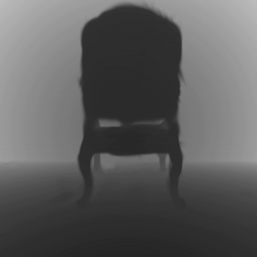
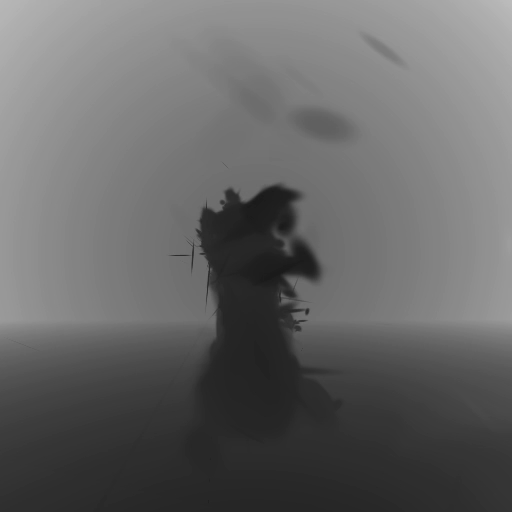
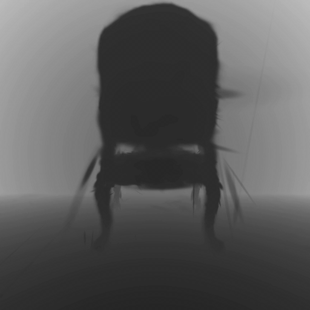

# Plato3DGRT

3D reconstruction of hidden geometry from two-bounce lidar, using **3D Gaussian Ray Tracing (3DGRT)** as the scene representation instead of NeRF.

<table>
  <tr>
    <td align="center"><b>Chair</b></td>
    <td align="center"><b>Dragon</b></td>
    <td align="center"><b>Occlusion</b></td>
  </tr>
  <tr>
    <td></td>
    <td></td>
    <td></td>
  </tr>
  <tr>
    <td align="center" colspan="3"><i>All trained in ~35 minutes on an RTX 5070</i></td>
  </tr>
</table>

This repo integrates two open-source projects:

- [NVIDIA 3DGRUT](https://github.com/nv-tlabs/3dgrut) — 3DGRT (SIGGRAPH Asia 2024) / 3DGUT (CVPR 2025) rendering backbone
- [PlatoNeRF](https://github.com/facebookresearch/PlatoNeRF) — hidden-geometry reconstruction from single-view two-bounce ToF lidar (CVPR 2024)

PlatoNeRF recovers occluded 3D geometry by learning to explain two-bounce lidar shadow patterns. The original method uses NeRF as the scene model. This repo replaces that backbone with 3DGRT — Gaussian primitives rendered via OptiX BVH ray tracing — which gives explicit geometry and faster convergence.

New files relative to the upstreams:

```
PlatoNeRF-main/src/run_platonerf_3dgrt.py         # training (3DGRT backend)
PlatoNeRF-main/src/render_test_depth_3dgrt.py      # inference / depth map extraction
```
